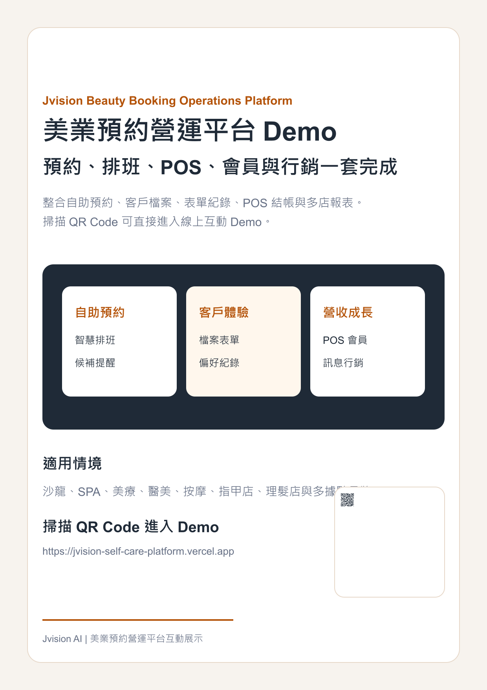

# Jvision 美業預約營運平台 Demo

可互動測試的沙龍、SPA、美療、醫美、按摩、指甲店與多據點品牌營運平台。

## Demo

- 正式網址：https://jvision-self-care-platform.vercel.app
- 線上海報：https://jvision-self-care-platform.vercel.app/marketing/jvision-self-care-platform-poster.png
- 產品介紹 PDF：https://jvision-self-care-platform.vercel.app/marketing/jvision-self-care-platform-product-introduction.pdf

## 專案海報

## 功能

- 自助預約與智慧排班
- 客戶檔案、偏好與諮詢表單
- POS 結帳、訂金、會員點數
- 會員方案與回訪訊息
- 多店營運儀表板

## 素材

行銷素材放在 `docs/marketing`，同時複製到 `public/marketing` 供 Vercel 正式站直接存取。
